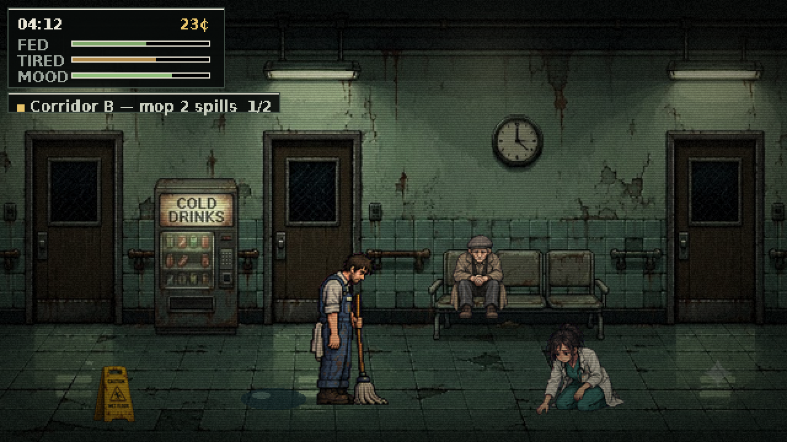

# The Next Shift

A 16-bit narrative simulation about a hospital janitor working 02:00 → 06:00,
and about the money the last player decided not to keep.

You start the shift with coins you did not earn. You mop, you get paid a few
coins at a time, and you meet five people and a cat who need something. At 06:00 you open
locker 14, take off the overalls, and decide how much of what you have left
stays on the shelf for whoever plays next.

The starting money is not a game constant. It is the previous player's actual
decision, read back off Solana devnet.



---

## The loop

```
     ┌──────────────────────────────────────────────────┐
     │  read the last player's memo off solana devnet   │
     └────────────────────────┬─────────────────────────┘
                              ▼
        02:00  ─────────  four hours  ─────────  06:00
         mop spills · buy food · get tired · say yes or no
                              ▼
     ┌──────────────────────────────────────────────────┐
     │  the cracked mirror describes your night (Gemini) │
     │  you record 140 characters and choose what stays  │
     │  it is written back to devnet for the next player │
     └──────────────────────────────────────────────────┘
```

## How a night is put together

**Six people, and the night is long.** There are five human sprite sets and
five portraits, so there are five people plus a cat — one sprite is one person,
and `CAST_NAMES` keys the name to the sprite so a story cannot invent a second
identity for a portrait. Variety comes from time instead of headcount: 23 story
entries across those six, dealt onto *slots* (`game/world.ts`) a few at a time,
so the corridor is never full at 02:00 and no two shifts run in the same order.
A slot knows its pose and how far to lift a sprite so a seated person lands on
the bench instead of the floor, and a slot tied to a carryable follows it — move
the chair and the next person sits where you put it.

**The desk gives you work.** Radio calls from the head nurse are tasks, not
flavour: mop two spills in corridor B, get a wet floor sign out before somebody
falls, check the fire landing, walk the trolley back to the lockers. The sign
and the trolley are carried — pick them up, walk them somewhere, set them down.

**The story is told before the question is asked.** A person says their piece
first; only then does a separate panel ask what you do, with a short input lock
so a mashed key cannot answer for you.

**People come back.** A follow-up is an ordinary story gated on a flag one of
your choices raised, plus a delay — the state records *when* each flag went up,
so "an hour and a quarter after you paid for his prescription" is expressible in
data. Twelve of the thirty entries are callbacks, and they are where the night
actually lands: helping the intern is worth almost nothing at the time, and a
lot at four in the morning when she comes back with a coffee. Some of them are
not rewards. You can buy a man a coffee at two and be the person he tells at
three that it did not work.

**Mood is the fourth stat, and it renders.** It drains on its own, faster when
you are hungry or wrecked, and people move it far more than coffee does. Below
half the vignette closes in, the colour drains and the grain lifts; above 70 it
opens back up and warms. Crossing a threshold narrates one line and never
repeats it.

**The night ends with a ledger.** After the mirror, before the handover, you get
one line per person — and a follow-up overwrites the first account of them,
because it is the one that turned out to be true. Each of the three closing
steps names its instruction in the HUD and puts a beacon over the thing to walk
to, because at 06:00 nobody should have to guess the order.

`npm run check:content` statically verifies the tables: every story has a slot
it can appear in and an animation for its pose, every scene is reachable, and no
doorway drops you inside another doorway's trigger.

## Sponsor technology, and where it actually is

| | What it does | Where |
|---|---|---|
| **Solana devnet** | The shift ledger, as a verifiable linked list. Each handover is one transaction: a `SystemProgram.transfer` for the coins and a Memo Program instruction carrying `{app, shift, leftCoins, msg, prev}`, where `prev` is the signature of the shift this player inherited. Ordering is therefore provable from the memos themselves rather than trusted from the RPC's result order, and a broken link reports `verified: false`. No wallet install and no API key — devnet's RPC is public; a backend operator keypair signs. | `lib/solana.ts`, `app/api/solana/{shift,chain}/route.ts` |
| **ElevenLabs** | The previous player's message, the desk's radio calls, and the mirror — three different voices with three sets of voice settings. Speech is streamed and pushed through a 300–3400 Hz band-pass with soft clipping and carrier hiss, so the walkie-talkie sounds like a walkie-talkie. The radio registers are encoded at 22 kHz / 32 kbps *because* of that filter: inaudible after it, a quarter of the bytes. | `app/api/elevenlabs/tts/route.ts`, `game/audio.ts` |
| **Google Gemini** | The mirror above the sink. It receives what you earned, what you spent on yourself, what you spent on other people, your mood, and a timestamped list of every choice and how each one turned out, and answers in three sentences that do not moralise — under a `responseSchema`, so the reply is JSON of a declared shape rather than prose to be parsed. | `app/api/gemini/verdict/route.ts` |

Every integration degrades instead of breaking. No devnet key → an in-process
ledger, clearly labelled as simulated. No ElevenLabs key → the game is silent
where a voice would be. No Gemini key → a hand-written fallback monologue
selected from the same numbers.

## Everything you hear is synthesised

There are no audio files in this repository. The fluorescent hum is a 50 Hz saw
through a low-pass with a 100 Hz square harmonic on top; the rain is shaped
brown noise in two bands; the mop is a band-pass sweep; the monitor beeping four
rooms away is a sine blip on a four-second timer. See `game/audio.ts`.

## The art pipeline

The source art is twenty-odd sheets composited over flat magenta. Two things
made the difference:

* **Chroma keying, not thresholding.** The artist painted translucent things —
  mop water, wet cloth, anti-aliased edges — directly onto the magenta, so a
  hard threshold either keeps them as bright pink or eats them whole. Instead
  `tools/build_assets.py` solves the compositing equation: magenta excess gives
  fractional alpha, then the key colour is un-mixed back off. Residual pink went
  from 0.40 % of opaque pixels to 0.11 %.
* **Premultiplied downscaling.** Sprites are shrunk to game size in
  premultiplied space, so transparent pixels cannot bleed colour into the
  silhouette.

Frames are found by connected-component labelling rather than a fixed grid,
because the sheets are not on one. `tools/sheet_spec.py` maps the detected
frames to named animations and, crucially, gives each animation its own target
height in game pixels — the sheets are not drawn at a consistent scale between
poses, so a per-sheet scale factor leaves the old man taller sitting than
standing.

The text is a 1-bit bitmap font baked from DejaVu Sans Bold at 12 px
(`tools/build_font.py`), so the game needs no webfont and renders crisply at
every integer zoom. It includes the Turkish glyphs the locker-room art uses.

## Running it

```bash
npm install
npm run assets          # rebuild public/assets from the source art (optional)
cp .env.example .env.local
npm run dev
```

To put it on a real ledger — note there is no Solana API key to fetch, only a
keypair to generate:

```bash
node tools/new-devnet-key.mjs        # mints the operator key, tries to fund it
# paste SOLANA_SECRET_KEY into .env.local
# if the public faucet is dry, fund the printed address at faucet.solana.com
```

Without any keys in `.env.local` the game is fully playable — it just runs
silent, with a local ledger and the fallback mirror.

## Controls

| | |
|---|---|
| `WASD` / arrows | walk |
| `E` / `Enter` | talk, use, go through a door |
| `Space` | mop (hold, standing on a spill) |
| `↑` `↓` + `E` | choose (or click) |
| `E` | pick up / set down the sign, trolley or chair |
| `Esc` | walk away from the vending machine |

## Layout

```
game/          the engine: loop, state, renderer, audio, dialogue, world
  world.ts     scene geometry -- floor bands, exits, hotspots, light sources
  content.ts   every line of writing in the game, in one file
app/api/       the three integrations, one route each
lib/solana.ts  memo read/write against devnet
tools/         the asset pipeline (python: pillow, numpy, scipy)
public/assets/ generated -- atlas, manifest, backgrounds, portraits, font
```

Built for the DEV Weekend Challenge: Generosity Edition.

## Licence

The **code** is MIT — the engine, the asset pipeline, the API routes, the tools.
Take any of it.

The **artwork** is CC BY-NC 4.0: share and adapt it with credit, but not
commercially. That is the `background/`, `characters/` and `sheet/` folders,
`cat.png`, `furniture.png`, and everything generated from them under
`public/assets/`.

See [LICENSE](LICENSE) and [LICENSE-ART](LICENSE-ART).
