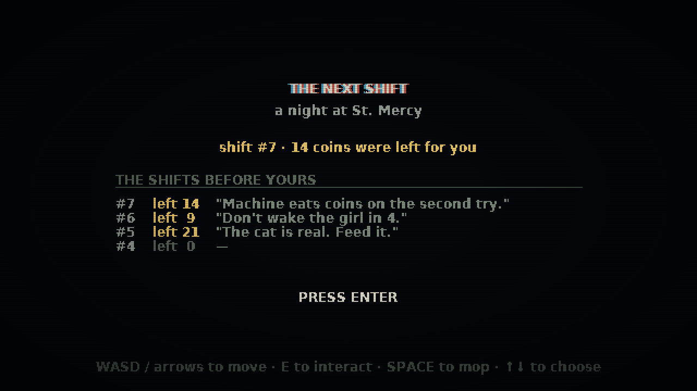
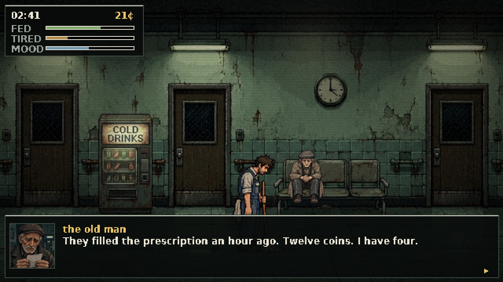
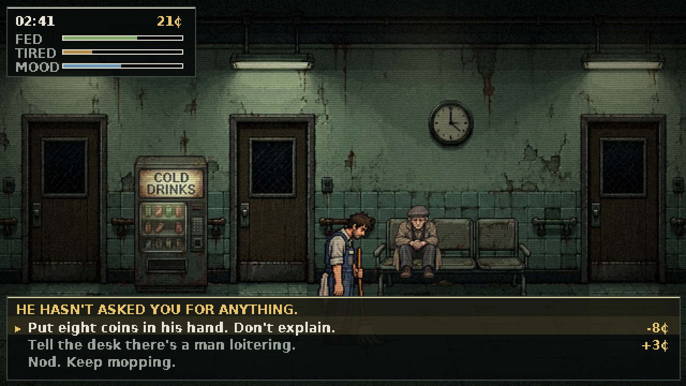
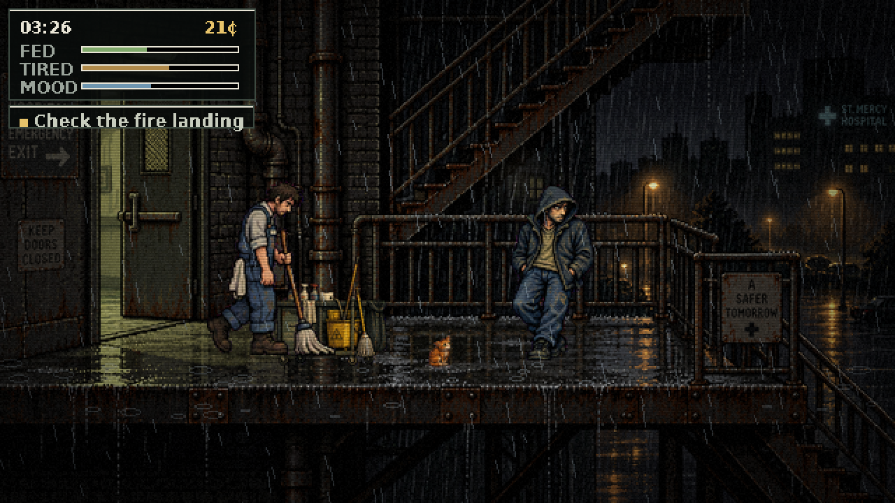
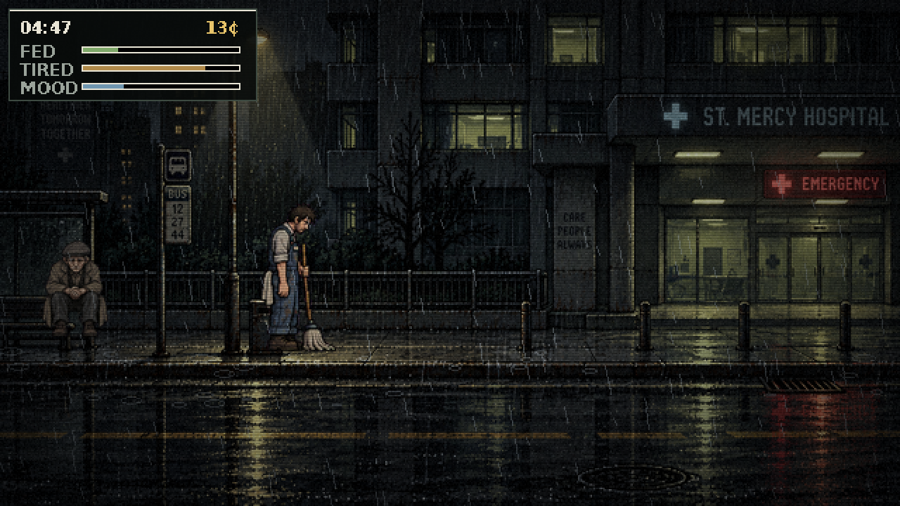
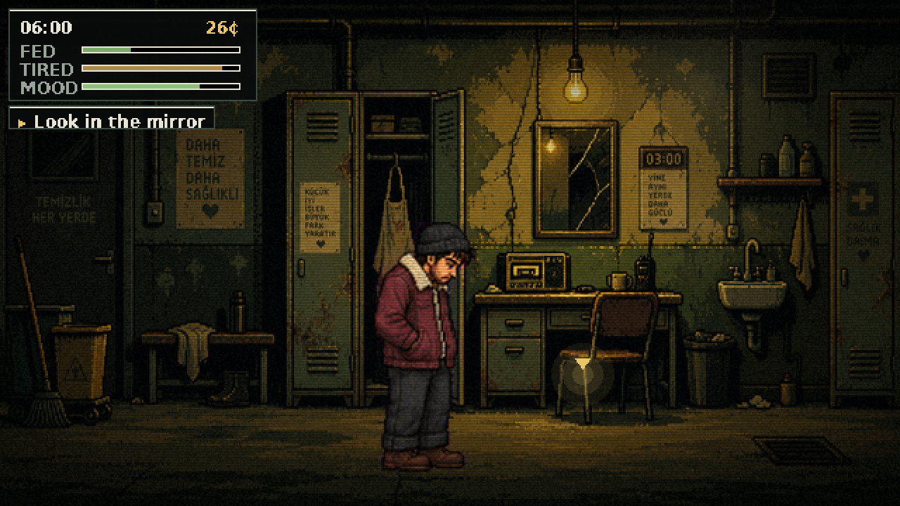

THE NEXT SHIFT is a 16-bit narrative simulation about four hours of night cleaning in a public hospital — and the money you begin with is the only thing in it that isn't fiction.

You don't earn your opening balance. You find it in locker 14, wrapped in a cleaning cloth, left there by whoever played this game before you, along with 140 characters they recorded on a radio that only receives. At 06:00 you take off the overalls and decide how much of what's left stays on the shelf. That decision is written to a chain, and it is what the next person opens the locker to.


_Four people have already worked this shift. Two of them left you something._

---

## What I Built

02:00. Corridor B is a swamp and you have a mop.

The loop is small on purpose: mop the spills the desk radios you about, get paid two or three coins at a time, buy a sandwich from a machine that sometimes eats your coin. Four hours pass in seven minutes of real time. Hunger falls. Fatigue climbs.

And people arrive. Not all at once — one or two at a time, all night, dealt out of a pool onto the benches and the doorways and the wet fire landing.


_Neither of them has asked you for anything. That is the difficulty._

There are six of them and no more, because there are six portraits and I refuse to give one face two names. An old man four coins short of a prescription. An intern who dropped a patient's charts at three in the morning and cannot pick them up. A man outside theatre 2 who has counted the corridor tiles nine times. A head nurse who needs twenty minutes off the floor and someone who didn't see her leave. A man on the fire landing with thirty coins and a request. A cat.


_He gets to finish. Nothing is asked of you while he is still talking._


_Eight coins is eight coins. So is three._

Every answer costs something you were counting: coins, or minutes off a four-hour clock, or half the sandwich in your pocket. Nobody thanks you at the time.

**But they come back.** Help the intern and she is worth almost nothing at the time — four points of mood, a shrug. At four in the morning she finds you in the corridor with a coffee from the doctors' machine, and that is worth fourteen. Buy the man outside theatre 2 something hot at two, and at three he may be sitting on the floor beside the chair telling you it was the bleeding, and that he has been thinking about that coffee for an hour.

The night does not promise that kindness works. It only promises that it comes back to tell you.


_Everything on this landing wants something. One of them is a cat._

There is a fourth stat under FED and TIRED, and it is called MOOD. It drains on its own, faster when you're hungry, faster still when you're wrecked — and people move it far more than coffee does. Let it fall and the game says so without a word: the vignette closes in, the colour drains out of the street, the grain lifts. Somewhere under 24 you stop in the middle of the floor and cannot immediately think why you started.


_Nothing has happened. That is somehow the worst version of it._

At 06:00 the desk says go home. You walk to locker 14, put the overalls in the bag, and look into a cracked mirror that has watched the whole shift and describes it back to you in three sentences. Then a ledger: one line per person, and what happened to them — a follow-up overwrites the first account, because it's the one that turned out to be true.

Then the walkie-talkie, and the only real decision in the game.


_The game will not do this part for you._

---

## How it connects to the theme

Generosity is easy to write as a button. The hard part is making it cost, and making it anonymous.

So the coins are not a score. They are a real balance, sitting in a Memo Program instruction on Solana devnet, and every coin you leave is a coin you don't have. You will never meet the person who gets them. You will never know if they kept them. The only thing you can be sure of is that they will see what you left, and the 140 characters you left with it, before they mop a single tile.

Every player is somebody's previous shift.

---

## A word before you play

Bring headphones — the ambience is doing more work than the graphics.

It's about seven minutes. Don't rush the locker at the end; that's the part the rest of it is for. And when someone comes back to you at four in the morning, it's because of something you did at two.

## Demo

*(deployment link)*

## Code

https://github.com/miclaldogan/the-next-shift

It runs with no keys at all — silent, on a local ledger, with a hand-written mirror. Every integration degrades instead of breaking, which is the only reason I could keep building at four in the morning when a faucet was dry and a rate limiter had opinions.

```bash
npm install
cp .env.example .env.local
npm run dev
```

---

## How I Built It

Next.js and TypeScript, one HTML5 canvas at 640×360, and a Python asset pipeline. The systems:

- **A ledger that is a linked list, not a receipt.** Each handover is one transaction: a `SystemProgram.transfer` for the coins and a memo carrying `{app, shift, leftCoins, msg, prev}`. `prev` is the signature of the shift *this* player inherited — so the handovers chain, the ordering is provable from the memos instead of trusted from whatever order the RPC returned, and a broken link is detectable. Point one record at the wrong parent and the API says `verified: false`. The title screen reads the last four back.

- **A mirror that has been paying attention.** At 06:00 Gemini receives what you earned, what you spent on yourself, what you spent on other people, your mood, and a timestamped list of every choice *and how each one turned out* — then answers in exactly three sentences, under a response schema, with the last one required to be small and physical. It is not allowed to moralise and it is not allowed to say "kindness".

- **Three voices, one of them through a radio.** ElevenLabs speaks the previous player's message, the desk's calls and the mirror. The first two are band-passed to 300–3400 Hz, soft-clipped with `tanh` and laid over carrier hiss, so the walkie-talkie sounds like a walkie-talkie. The mirror plays dry.

- **Everything else you hear has no file behind it.** The fluorescent hum is a 50 Hz sawtooth through a low-pass with a 100 Hz square harmonic on top. The rain is shaped brown noise in two bands. The monitor beeping four rooms away is a sine blip on a four-second timer. There are no audio assets in the repository.

- **Six people, dealt over time.** Stories are entries in one file, gated on flags and delays: `needsFlag: "oldman_helped", delayAfterFlag: 75`. The state records *when* each flag was raised, so "an hour and a quarter after you paid for his prescription" is expressible as data. Seventeen of the twenty-three entries are callbacks. A person can only be in one place at once.

- **A validator that refuses my mistakes.** `npm run check:content` rejects a story whose pose has no slot in its scene, a follow-up waiting on a flag no choice ever raises, a doorway that drops you inside another doorway's trigger, a pose more than six stories share one slot for — and one name per sprite, which is the rule I broke worst before I wrote it down.

### Four things that only doing it taught me

**Chroma keying is not thresholding.** The art arrives composited over flat magenta, and the obvious `(r>200)&(g<60)&(b>200)` is wrong in a way you only see up close: the artist painted translucent things *onto* the magenta — mop water, wet cloth, every anti-aliased edge. My first build had a vivid pink puddle under the mop, because the water was a grey film over the backing and came out at `(80,1,73)` — magenta, nowhere near the threshold. The fix is to stop classifying pixels and solve the compositing equation instead. Magenta excess gives fractional alpha; then un-mix the key back off.

```py
excess = np.minimum(r, b) - g
alpha  = np.clip(1.0 - excess / 226.0, 0.0, 1.0)     # 226 = the key's own spread
fg     = (rgb - (1.0 - alpha) * KEY) / np.maximum(alpha, 0.02)
```

That puddle pixel comes out at alpha 0.68 over near-black — a dark wet streak on the floor, which is what it was always meant to be. Residual pink across the atlas went from 0.40 % of opaque pixels to 0.11 %, and the edge-erosion pass I'd written became unnecessary. Fractional alpha *is* anti-aliasing.

**Everybody was walking sideways.** A tester told me the old man on the bench "keeps turning left and right". He was right, and it wasn't the animation. Frames are found by connected-component labelling and each one is cropped to its own content, then anchored at the centroid of its bottom slab — the feet. When an arm moves, the bounding box changes, so the crop changes, so the anchor changes, so the *body* jumps. The fix is to measure the error and cancel it: stamp every frame at its own anchor, find the whole-pixel shift that best overlays it on the first frame, fold that back in. The build now prints what it corrected, and the answer was much worse than one old man:

```
mc.walk        10px      ← the player character, all night
oldman.walk     9px
nurse.walk_far  7px
intern.kneel    6px
…12 animations
```

Ten pixels on a 132-pixel sprite. Nobody had reported the player sliding around, because nobody looks at the thing they're steering. They looked at the old man sitting still, where the same defect had nowhere to hide.

**Thirty characters made the game worse.** I expanded the story pool to thirty entries and five portraits ended up playing eighteen named people. The nurse PNG was five different women. You notice in about four seconds, and then nothing in the building is true any more. Cutting back to six identities and moving the variety into *time* is the single best change I made — and I now generate names from a table keyed by sprite, so a story physically cannot invent a second face.

**The live API is a different API.** A Gemini key issued today can call neither `gemini-2.0-flash` nor `gemini-2.5-flash` — both are closed to new users, and it tells you at request time, as a 404 with a sentence of prose inside it. So the model is an alias, not a pin. Then the free tier started answering `503 "This model is currently experiencing high demand"` on roughly one request in three, at random — I spent twenty minutes certain my schema was malformed before I noticed a *plain* request failing the same way. Retrying the same model against a capacity wall is optimism, so three attempts rotate across two models with backoff. It lands on the second one now. And Flash is a thinking model: `parts` can carry reasoning beside the answer, and concatenating all of them produces invalid JSON from a model emitting perfectly valid JSON.

One more, for anyone about to reach for a Solana tutorial: **there is no API key.** Devnet's RPC is public and keyless. What you need is a signing key, which nobody issues to you — `Keypair.generate()` is the whole ceremony. The one thing worth paying attention to is that the public faucet is rate limited and frequently dry, which it told me in production terms about eight times in a row, so a provider endpoint in `SOLANA_RPC_URL` is the difference between a demo that works when four judges open it at once and one that doesn't.

---

## Prize Categories

Submitting to **Solana**, **ElevenLabs** and **Google AI (Gemini)** — the chain is the premise rather than a receipt, the voices are filtered into the room rather than played over it, and the mirror is given the whole night and told not to moralise about it.

---

Solo submission — built and designed by Iclal Doğan.
GitHub: [@miclaldogan](https://github.com/miclaldogan)

Bring headphones. Mop the corridor. And when you get to the locker, don't count it twice — you already know what you're going to do.
